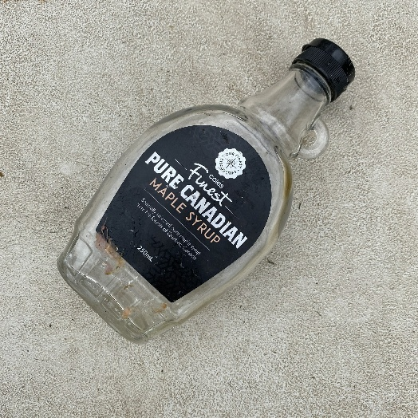
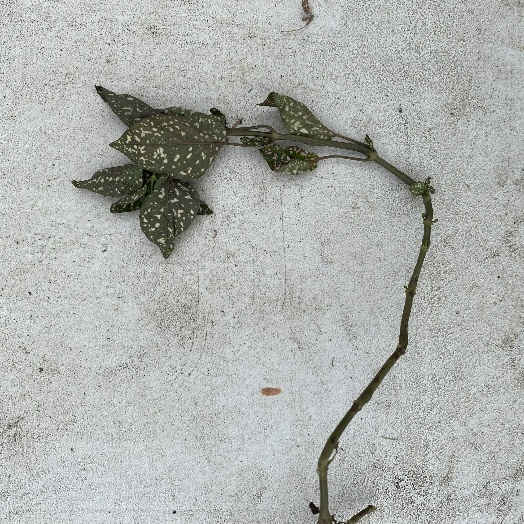
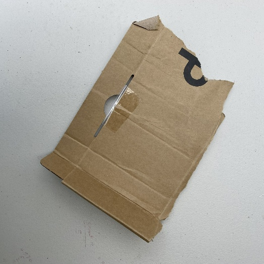

# Waste Classification System

## Overview
This project aims to classify waste materials into four categories: **Glass, Vegetation, Paper, and Cardboard**. The classification is based on weight calculations and material properties, helping in efficient waste management and recycling.

## Features
- **Automated Classification**: Uses machine learning to classify objects.
- **Weight Estimation**: Calculates the weight based on volume and density.
- **Image Processing**: Uses object recognition techniques for better classification.

## Classification

Our system classifies objects into four categories: **Glass, Vegetation, Paper, and Cardboard**. The classification is based on weight calculations and other relevant features.

### Categories:

#### 1. Glass


#### 2. Vegetation


#### 3. Paper


#### 4. Cardboard


### Weight Calculation:
We classify objects based on their **weight and material properties** using a machine learning model. The weight estimation formula:

\[
\text{Weight} = \text{Volume} \times \text{Density}
\]

Where:
- **Volume** is estimated from the object's dimensions.
- **Density** is predefined based on material type.

The system then assigns the object to one of the four categories based on calculated weight and other distinguishing features.

## Installation

To set up the project, follow these steps:

```bash
git clone <repository-url>
cd waste-classification
pip install -r requirements.txt
```

## Usage

Run the classification model:

```bash
python classify.py --image <path-to-image>
```

## Technologies Used
- **Python**
- **OpenCV** (for image processing)
- **TensorFlow/PyTorch** (for classification)
- **NumPy & Pandas** (for calculations and data handling)

